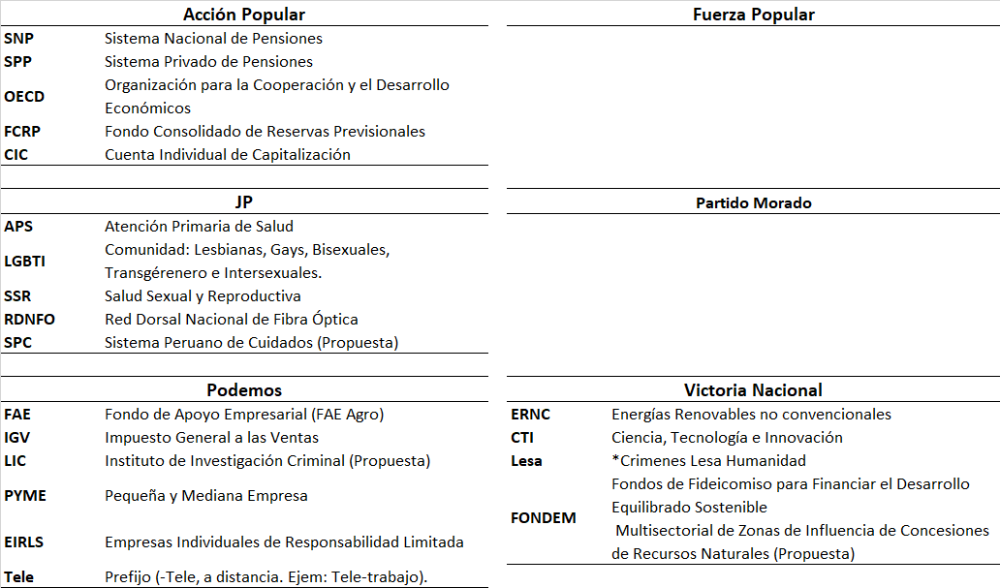

```{r, include=FALSE}

knitr::opts_chunk$set(
                      echo=FALSE, 
                      warning=FALSE, 
                      message=FALSE)
```

# Introducción

```{r,include=FALSE}
library(tidyverse)
library(tidytext)
library(GGally)
library(ggthemes)
library(widyr)
library(igraph)
library(wordcloud)
library(wordcloud2)
library(RColorBrewer)
library(scales)
  library(ggraph)
  library(tidygraph)
library(reshape2)
```

En este documento se analizan los planes de gobierno para la presidencia Peru-2021, planes registrados ante el **JNE** por los respectivos partidos (los planes de gobierno se pueden descargar desde [acá](https://drive.google.com/drive/folders/1RiqHdqcj5McYOyFilHZiLQuyLUIvhI0w)). Debido a la enorme cantidad de partidos (23) solo se analizaran los 6 principales partidos con mayor intención de votos según [IPSOS](https://www.ipsos.com/sites/default/files/ct/news/documents/2021-01/anexo1_publicacion.pdf).

El procesamiento de la encuesta replica el libro [Tidy Text](https://www.tidytextmining.com/), de Julia Silge y David Robinson.

Primero se analizará el conjunto de los planes de gobierno de los 6 partidos con mayor intención de voto según [IPSOS](https://www.ipsos.com/sites/default/files/ct/news/documents/2021-01/anexo1_publicacion.pdf): **Victoria Nacional, Fuerza Popular, Partido Morado, Juntos por el Perú, Podemos Perú** y **Acción Popular**. Posteriormente, se mostrará una breve comparación entre partidos. Finalmente, se realizará un análisis a cada uno de los planes de gobierno para dar paso a las conclusiones.

El fin del análisis es ayudar al lector a entender las diferencias entre los distintos planes de gobierno. Para este fin, se busca ser imparcial a la hora de presentar los planes de gobierno.

```{r,include=FALSE}
#Primero llamo a los planes de gobierno en PDF
# Fuerza_Popular    = pdf_data("Data/Fuerza_popular.PDF")
# Partido_Morado    = pdf_data("Data/Partido_morado.PDF")
# Accion_Popular    = pdf_data("Data/Accion_popular(peor_partido).PDF")
# JP                = pdf_data("Data/Juntos_por_Peru(JP).PDF")
# Podemos        = pdf_data("Data/Podemos.PDF")
# Victoria_Nacional = pdf_data("Data/Victoria_nacional.PDF")
#Luego los trato de agrupar
# z     = tibble() #Base de datos vacia
# cosas = objects()  #los nombres de todas las variables en el environment

#Ahora, sumaré todos los planes de gobierno (y sus hojas) en una sola base de
#datos
# for (i in cosas[cosas!="z"]){
#   x = get(i)
#   for(j in 1:length(x)){
#     if(j==1){
#       z1 = tibble(x[[j]]["text"],Hoja = j,Partido = i)
#       z = bind_rows(z,z1)
#     }else{
#       z = x[[j]]["text"] %>% 
#         tibble(Hoja = j,Partido=i) %>% 
#         {bind_rows(z,.)}
#     }
#   }
# }

#Elimino todas las variables que no sean "z" 
# rm(list=setdiff(ls(),"z"))
z = read_rds("z.rds")
#El procesamiento####
#Primero convoco a las stop_words (palabras inútiles)
#Opciones? = ,"nacional","sistema","gobierno","servicios",,"instituciones"
stop_words = read.table("Stopwords.txt",encoding = "UTF-8") %>%
  rename("word" = V1) %>%
  mutate(word = as.character(word)) %>%
  add_row(word=c("año","partido","morado","indicadores","metas","mil","sector","dimensión","meta","nivel")) %>% #Añades palabras inutiles según el contexto (y los resultados)
  as_tibble()

#Proceso el acumulado de planes de gobierno
  tidy_detalle = z %>%
    unnest_tokens(word,text) %>% #Función unnest, cada palabra es una observación (sin signos)
    anti_join(stop_words) %>% #Elimino stop words
    filter(grepl("^[A-Za-z]+$",word)) #Solo palabras (sin numeros ni signos)

  tidy_lineas = z %>%
    group_by(Partido) %>%
    summarise(text = paste(text,collapse = " ")) %>%
    unnest_tokens(output = word,token = "regex",text,pattern = "(?<=\\.)\\s+")
  
# Sentimientos
  sentiment  = readxl::read_excel("dictionary.xlsx") %>% 
    rename("word" = "term") %>% 
    filter(word!="mil" & word!="popular" & word!="victoria" & word!="ama")
  
  palabras_sentimiento = tidy_detalle %>%
    inner_join(sentiment) %>%
    mutate(score = ifelse(score_pos=="1","Positivo","Negativo")) %>%
    count(word,score,sort=TRUE) 
  
  partido_sentimiento = tidy_detalle %>%
    inner_join(sentiment) %>%
    mutate(score = ifelse(score_pos=="1","Positivo","Negativo")) %>%
    count(word,Partido,score,sort=TRUE) 
  #Bigramas
 
  
  
  tidy_itf =  z %>%
    unnest_tokens(word,text) %>% 
    filter(grepl("^[A-Za-z]+$",word))  %>% 
    count(Partido,word,sort=TRUE)
  
bigramas = z %>%
  group_by(Partido) %>%
  summarise(text = paste(text,collapse = " ")) %>% 
  ungroup() %>% 
  unnest_tokens(bigram,text,token = "ngrams", n=2) %>% 
  separate(bigram, c("word1", "word2"), sep = " ") %>% 
    filter(grepl("^[A-Za-z]+$",word1)) %>% 
    filter(grepl("^[A-Za-z]+$",word2)) %>% 
  filter(!word1 %in% stop_words$word) %>%
  filter(!word2 %in% stop_words$word) %>% 
  unite(bigram, word1, word2, sep = " ") 
#Sentimienos

detalle_sentimiento = tidy_detalle %>%
  inner_join(sentiment) %>%
  mutate(score = ifelse(score_pos=="1","Positivo","Negativo")) %>%
  count(Partido, score) %>%
  spread(score, n, fill = 0) %>%
  mutate(score = (Positivo - Negativo)/(Positivo+Negativo)) %>% 
  arrange(score)
```

# Resultados Globales

A continuación se muestra una nuble de palabras del conjunto de los 6 planes de gobierno:

```{r}
tidy_detalle %>%
    count(word,sort = TRUE) %>%
    wordcloud2(size=0.8,fontWeight = "bold",color="random-dark",minSize = "Hola todos",
               maxRotation = pi/9,minRotation = -pi/9) 
```

Las 10 palabras más repetidas muestran un interés de los principales partidos políticos en buscar el **desarrollo** del país, con un fuerte enfoque en la **salud** (acorde con la crisis sanitaria actual). La propuesta de mejorar el **sistema/servicios/gobierno** va acorde a la repetición de dichas palabras.

<center>

```{r,fig.align='center'}
tidy_detalle %>% 
    count(word,sort=TRUE) %>% 
    top_n(10,n) 
```

</center>

## Sentimientos Globales

Ciertas palabras están asociadas a sentimientos negativos (Ejem: problemas, pobreza, crisis, etc.) y positivos (Ejem: reforma, propuesta, bienestar, etc.). Al realizar un conteo de dichas palabras, podemos inferir que sentimiento está asociado al discurso global:

```{r}
  palabras_sentimiento  %>%
    select(word,score,n) %>%
    acast(word ~ score, value.var = "n", fill = 0) %>%
    comparison.cloud(colors = c("darkred", "darkblue"),random.order = FALSE,
                     max.words = 400,scale=c(4,.1),title.size = 2.5)
```

Se puede apreciar que los sentimientos negativos están presentes en palabras como: Pobreza, crisis, lucha. Asimismo, los sentimientos positivos están presentes en palabras como: Reforma, Derecho, Capacidad.

Podemos inferir que los planes de gobierno en general posicionan un discurso en contra de la **crisis/pobreza**, ofreciendo **reformas/mejoras** enfocadas en **derechos/capacidades**.

# Comparación entre partidos

Ahora haremos una comparación entre los planes de partido. A continuación se presenta una nube de palabras separadas entre los principales partidos.

```{r,fig.height=7,fig.width=8}
  tidy_detalle %>%
  count(Partido,word,sort = TRUE) %>% 
    select(word,Partido,n) %>%
    group_by(Partido) %>% 
    mutate(n = (n^(2))/sum(n)) %>% 
    filter(n > 0.0008) %>% 
    ungroup() %>% 
    acast(word ~ Partido, value.var = "n", fill = 0) %>%
    comparison.cloud(random.order = FALSE,title.size=1.1,colors = c("black", "darkorange","red","#6600CC","deeppink2","seagreen4"),
                     max.words = 400,scale = c(4,.9))
```

### Comparación Total de Palabras

Al ver las palabras más repetidas por plan de gobierno, se puede ver que la palabra **salud** ocupa los primeros puestos en todos los planes de gobierno (excepto en el plan de victoria nacional, el cual por la forma en la que está escrita, hace más énfasis en palabras introductorias).

Los siguientes puestos nos dan ideas más heterogeneas acerca de los temas de relevancia para cada plan. Vale la pena mencionar que se eliminaron las siguientes palabras por **estar relacionadas al tema de gobierno**: Nacional, Sistema, Servicios, Gobierno, Programa, Propuesta, Plan y Servicios. Adicionalmente, se borraron las siguientes palabras por no tener relevancia sin contexto: Millones, Niveles, Enfoque, Forma, Proponemos, Inclusive e Impulsaremos.

```{r,fig.height=9,fig.width=7,fig.align='center'}
#El top 3 por partido
  ommit4 = tibble(word=c("Nacional","Sistema","Servicios","Gobierno","Programa","Propuesta","Servicios","Plan","Millones","Niveles","Enfoque","Forma","Proponemos","Inclusive","Impulsaremos"))
  #Proceso la data para graficarla
  p = tidy_detalle%>% 
    group_by(Partido) %>% #Agrupo por partido
    count(word, sort = TRUE)  %>%  #Cuento las palabras
    mutate(n = n*100/sum(n)) %>%  
    mutate(word = reorder(str_to_title(word), n)) %>% #Le pongo mayuscula al inicio
    anti_join(ommit4) %>% 
    top_n(16,n) %>% #Me quedo con el top 15
    ungroup() %>% 
    arrange(Partido,n) %>% #Ordeno por partido y numero
    mutate(order = row_number()) %>% 
    mutate(color = ifelse(word=="Salud","red","black")) 
           #El orden (para el gráfico)

  #grafico con GGPLOT
  p  %>% 
    ggplot(aes(order, n,fill=n)) +
    geom_col(show.legend = FALSE) +
    xlab(NULL) +
    coord_flip() +
    facet_wrap(~Partido,ncol = 2,scales = "free") +
    scale_x_continuous(
      breaks = p$order,
      labels = p$word,
      expand=c(0,0)
    ) +
    labs(y="Porcentaje de veces que se repite la palabra\n(Respecto al total de palabras en el plan)") +
    theme(strip.text.x = element_text(),
          axis.text.y = element_text(face="bold")) + 
    scale_fill_gradient(low="darkblue", high="red") +
   theme(axis.text.y = element_text(size = 10, face ="bold",colour = "black")) 
```

Como se mencionó antes, las palabras más repetidas **(Nacional, Sistema, Desarrollo, Servicios, Gobierno)** son comunes entre los partidos y por eso han sido eliminadas. Estas palabras son todas relacionadas a un tema común entre los documentos: **Un plan de gobierno de un país**. Sin embargo, los temás relacionadas a **Salud** y **Desarrollo** son comunes entre todos los planes, debido al contexto del COVID-19 y la crisis económica trás la pandemia.

Quizá una aproximación interesante sería extraer las palabras más repetidas en un plan de gobierno, pero que a la vez, no sea muy repetida entre todos demás los planes de gobierno.

### Comparación TF-IDF

El siguiente acercamiento se llama [**tf-idf**](https://useo.es/tf-idf-relevancia/) la cual es una técnica de recuperación de información, usada para obtener la información más relevante de libros en una biblioteca. En esencia, mide la frecuencia de un término en un documento, comparándolo con la frecuencia del término dentro de una colección entera de documentos. Usaremos la metodología usada en [Tidy-Text.](https://www.tidytextmining.com/tfidf.html)

```{r,fig.height=9,fig.width=6,fig.align='center'}
omision = tibble(word = c("fujimorismo","morado","morada","c","g","victoria","ama","seas","sua","quella","llulla","https","mil","juan","forma","respectivas","lineamientos","ocioso","mentiroso","b","partido","modos","identificados","indicadores","inclusive","encontramos","respectivamente","permitido","lineamiento","plantean","n","podemos","infoestructura","ap","pe","in","mm","bn","desatada","pasar","especifica","crearemos","elevaremos","lanzaremos","optimizaremos","estableceremos","emprenderemos","entornos","pobreza","compartida","progresar","republicanos","promesa","deberes","vamos","rescatar","fujimori","previsto","diversidades","redundancias","talentos","poblacionales","conscientes","h","mano","segmentos","rubro","d","papeles","promulgada","concurrencia","agilizaremos","automatizado","atractivos","compartimentos","gestionaremos","palanca","pesado","estancos","dual"))

tidy_itf %>%
   anti_join(omision) %>% 
    bind_tf_idf(word, Partido, n) %>% 
   group_by(Partido) %>% 
   slice_max(tf_idf,n=12) %>% 
   ungroup() %>% 
   mutate(word = str_to_title(word)) %>% 
   ggplot(aes(tf_idf, reorder_within(word, tf_idf,Partido), fill = Partido)) +
   geom_col(show.legend = FALSE) +
   facet_wrap(~Partido, ncol = 2, scales = "free") +
   theme(axis.text.y = element_text(size = 12, face ="bold",colour = "black")) +
   labs(x = "TF-IDF", y = "Palabras",title = "Palabras TD_IDF en planes de gobierno",subtitle = "Palabras poco comunes en los demás planes de gobierno") +
  scale_y_reordered()
 

```

Hay palabras interesantes, pero hay varias abreviaturas que explicamos a continuación:

<center>



</center>

Se puede hacer el mismo análisis de IT_ITF usando combinaciones de palabras:

```{r,fig.height=9,fig.width=8,fig.align='center'}
 
  omision2 = tibble(bigram = c("partido morado","fuerza popular",
                               "victoria nacional","acción popular",
                               "sua ama","llulla ama",
                               "morado propone","ingreso 15",
                               "expuesto proponemos",
                               "sentido proponemos",
                               "indicadores porcentaje","objetivos indicadores","pbi 1.1","pilar estratégico",
                               "20 mil","mil soles","mil habitantes","indicadores número",
                               "identificados objetivos","problemas identificados","metas 2021",
                               "lineamientos generales","indicadores metas","problema indicadores",
                               "metas contar","situación actual","físico legal","alto corresponde","porcentual anual","política política","diez puntos","mercado comparables","pondremos foco","siguientes acciones","siguientes medidas","vital importancia","gobierno peruano","gobierno nacional"))
   
bigramas2 = bigramas %>%
  anti_join(omision2) %>% 
  count(Partido, bigram) %>%
  filter(n>2) %>% 
  bind_tf_idf(bigram, Partido, n) %>%
  group_by(Partido) %>% 
   slice_max(tf_idf,n=10) %>% 
  ungroup() %>% 
  mutate(bigram = str_to_title(bigram)) %>% 
  arrange(Partido,tf_idf)

bigramas2 %>% 
  ggplot(aes(tf_idf, fct_reorder(bigram, tf_idf), fill = Partido)) +
  geom_col(show.legend = FALSE) +
  facet_wrap(~Partido, ncol = 2, scales = "free") +
    theme(axis.text.y = element_text(size = 12, face ="bold",colour = "black")) +
  labs(x = "TF-IDF", y = "Palabras",title = "Palabras TD_IDF en planes de gobierno",subtitle = "Palabras poco comunes en los demás planes de gobierno")

```

Hasta ahora, hemos interpretado a las palabras como fuentes de significado, el cual hemos aplicado a cada plan de gobierno. Ahora, interpretaremos a las palabras como fuentes de **sentimientos** y veremos que plan de gobierno hace uso de sentimientos positivos o negativos.

## Comparación de Sentimientos

Primero, vemos que palabras relacionadas a sentimientos positivos/negativos fueron las más mencionadas en los planes de gobierno:

```{r,fig.height=9,fig.width=8,fig.align='center'}
p3 = partido_sentimiento %>%
  group_by(score,Partido) %>%
  top_n(5,n) %>%
  arrange(Partido,n) %>%
  ungroup() %>% 
  mutate(order = row_number()) 
p3 %>% 
  ggplot(aes(order, n, fill = score)) +
  geom_col(show.legend = TRUE) +
  facet_wrap(~Partido , ncol = 2,scales = "free") +
  scale_x_continuous(
    breaks = p3$order,
    labels = p3$word,
    expand=c(0,0)
  ) +
  labs(y = "Contribución al sentimiento",
       x = NULL,
       fill=element_blank()) +
  coord_flip() +
      theme(axis.text.y = element_text(size = 12, face ="bold",colour = "black")) 
```

Al sumar la cantidad de palabras positivas y restar la cantidad de palabras negativas, por plan de gobierno, podemos obtener un *score* el cual nos da una idea del grado de sentimientos (positivos/negativos) que expresa cada documento.

```{r,fig.height=4,fig.width=8,fig.align='center'}

ggplot(detalle_sentimiento, aes(fct_reorder(Partido,desc(score)),score, fill = Partido)) +
  geom_col(show.legend = FALSE,position = position_dodge(width = 0.9),width = 0.6) +
  labs(title = "Score: (Palabras positivas - palabras negativas)/Total",x="Planes de Gobierno",y="Score") +
  theme_minimal()+
  geom_text(aes(label=percent(score,accuracy = 1)),check_overlap = TRUE,nudge_y = 0.02,size=5) +
        theme(axis.text.x = element_text(size = 10, face ="bold",colour = "black")) 
```

Se puede apreciar que el **Partido Morado**, así como **Juntos por el Perú** hacen más uso de palabras que emanan sentimientos positivos (derechos, reforma, sostenible, integral, etc.). En cambio, **Podemos** y **Acción Popular** hacen más uso de palabras que emanan sentimientos negativos (pobreza, baja, crisis, deuda, etc.). Esto nos da un indicio de qué sentimientos busca emanar cada partido, durante la lectura de su plan de gobierno.

## Correlación entre partidos

Finalmente, podemos ver la correlación que hay entre partidos, al encontrar el porcentaje de uso de cada palabra, y ver si es similar entre otros partidos.


```{r,fig.height=15,fig.width=8,fig.align='center'}
knitr::include_app("https://luis-jose-zapata-bobadilla.shinyapps.io/Presidentes/", height = "800px")
```

Finalmente, podemos ver las correlaciones, es decir, la probabilidad de que dos planes de gobierno usen palabras similares y bajo la misma frecuencia. Se puede observar como el Partido Morado es el que presenta la correlación con más partidos (considerando que en el proceso se removieron stop_words y palabras irrelevantes).

```{r,fig.width=12,fig.align='center',fig.height=8}

library(GGally)
omision3 = tibble(word=c("mmm","ii","alta","altas",
                         "inclusive","mil","etc","art",
                         "partido","haga","forma",
                         "asimismo","alcance","camino","vii"))


frecuenia = tidy_detalle%>%
    count(Partido, word) %>%
    group_by(Partido) %>%
    mutate(proportion = n / sum(n)) %>% 
    select(-n) %>% 
    anti_join(omision3)
frecuenia %>%  pivot_wider(word,names_from = Partido,values_from = proportion)  %>%  column_to_rownames("word") %>% mutate_all(~replace(.,is.na(.),0)) %>% ggcorr(nbreaks = 10,palette="RdGy",label=TRUE,label_size=5,label_color = "white",limits = c(0,1),midpoint = 0.5,layout.exp = 1)

```

# Conclusiones

Finalmente, podemos hacer una comparación entre los diferentes partidos. Vale la pena aclarar que todos los partidos políticos hacen referencia a temas demagogos como Educación, Salud, Trabajo, Recuperación de la economía, etc. Por lo tanto, las conclusiones escritas a continuación explican las leves características por las que resaltan del resto.

### Acción Popular

-   A diferencia de los demás planes de gobierno, **Acción Popular** muestra una presencia notoria de palabras relacionadas a las **pensiones** (pensiones, SNP,SPP,CIC, afiliados, etc), incluso cuando se cuenta el número de veces que se repiten las palabras.

-   El análisis de sentimientos indica que el plan se enfoca en los **sentimientos negativos** del lector, haciendo énfasis en palabras como pobreza, deudas, tributarias, abusivo, etc.

### Fuerza Popular

-   Muestra una fuerte presencia de palabras relacionadas a la **asistencia social**, así como **apoyo a pequeña empresa** (Social, Plan, Programas, Recursos, etc). Adicionalmente, también muestra un enfoque sobre la **pandemia actual**, y el caso de la distribución de vacunas/tests.

-   El análisis de sentimiento muestra un uso balanceado entre palabras de sentimiento negativo y positivo, debido a que, si bien usa palabras relacionadas a **pobreza** (lucha, crisis, problemas), también usa una cantidad similar de palabras relacionadas a **apoyo** (derecho, rescate, programas sociales, defendemos).

-   Hace una referencia (no común en los demás planes) a las marchas de noviembre 2020, contra Manuel Merino. Sin embargo, la postura del partido es que las marchas "afectaron negativamente" la imagen de la policía.

### Juntos por el Perú (JP)

-   A diferencia de los demás planes de gobierno, **Juntos por el Perú** muestra un fuerte enfoque de **derechos sociales** y **asistencia a minorías** (Social, Cultural, Pueblos, Servicios, LGTBI, Afroperuanos, etc).

-   El análisis de sentimientos indica que el plan busca un enfoque de **sentimientos positivos** en el lector, enfocandose en temas positivos como derechos, capacidades, fortalecer, etc.

-   En su plan se incluye temas relacionados a la educación y diversidad sexual, no muy debatidos en otros planes.

### Partido Morado

-   El plan de gobierno muestra una fuerte similitud con los demás planes de gobierno, en el sentido de que ampliamente **toca temas comunes en los planes de gobierno** (Salud, Educación, Servicios, etc) sin escribir ni más ni menos palabras que otros planes de gobierno.

-   Sin embargo, muestra algunos temas que, si bien son dispersos y no son amplios, no son muy comunes en los demás planes de gobierno: **Apoyo al talento y el deporte, el tema del "republicanismo", aprovechamiento de la cuarta revolución industrial, Maltrato Animal, apoyo a familia y adolescentes**, etc.

<!-- -->

-   El análisis de sentimientos indica que el plan tiene un **fuerte enfoque de sentimientos positivos** en el lector, haciendo poca referencia (como proporción sobre el total de palabras) a problemas sociales y palabras negativas como pobreza, riesgo, enfermedades, etc.

### Podemos

-   El plan de gobierno muestra una fuerte referencia a palabras relacionadas con **alivio de impuestos** y **facilidades a empresas** (IGV, Empresas, deudas, planillas, PYME, EIRLS, hipotecas, cobranza, etc). Adicionalmente, menciona un apoyo a **servicios a distancia** (tele-medicina, tele-educación, etc).

<!-- -->

-   El análisis de sentimientos indica que el plan tiene un **fuerte enfoque de sentimientos negativos** en el lector, haciendo bastante uso de de palabras relacionadas a carencias y problemas (baja, crisis, deudas, etc).

### Victoria Nacional

-   El plan de gobierno muestra una fuerte referencia a palabras relacionadas con **proyectos** (Gas, crudo, cadenas, infraestructura, etc) y **temas judiciales** (Ley, Jurados, Lesa Humanidad, Corte Penal, Penal Internacional, etc). Sobre lo último, cabe recordar una mención que hizo Forzyth hace poco sobre modificar el sistema judicial peruano.

<!-- -->

-   El análisis de sentimiento muestra un uso balanceado entre palabras de sentimiento negativo y positivo, debido a que, si bien usa palabras relacionadas a **problemas** (alta, falta, pobreza), también usa una cantidad similar de palabras relacionadas a **proyectos** (reforma, sostenible, competencias, etc).
